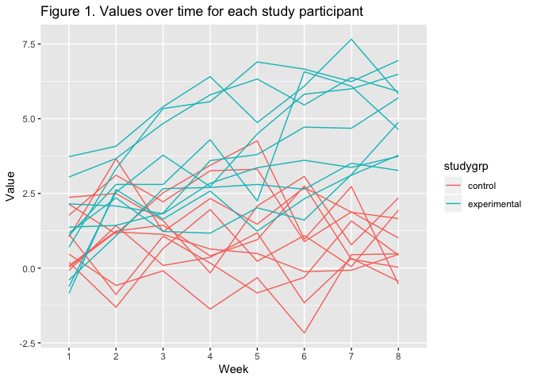
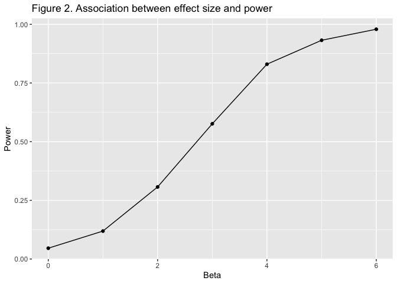

Homework 5
================
Amelia Zhao
2019-11-11

# This is my markdown file for Homework 5.

# Problem 1:

``` r
library(tidyverse)
```

    ## ── Attaching packages ──────────────────────────────── tidyverse 1.2.1 ──

    ## ✔ ggplot2 3.2.1          ✔ purrr   0.3.2     
    ## ✔ tibble  2.1.3          ✔ dplyr   0.8.3     
    ## ✔ tidyr   1.0.0.9000     ✔ stringr 1.4.0     
    ## ✔ readr   1.3.1          ✔ forcats 0.4.0

    ## ── Conflicts ─────────────────────────────────── tidyverse_conflicts() ──
    ## ✖ dplyr::filter() masks stats::filter()
    ## ✖ dplyr::lag()    masks stats::lag()

``` r
library(purrr)

set.seed(10)

iris_with_missing = iris %>% 
  map_df(~replace(.x, sample(1:150, 20), NA)) %>%
  mutate(Species = as.character(Species)) 


fill_na = function(x) {
  if (is.numeric(x) == TRUE) {
    x = x %>% replace_na(
      round(mean(x, na.rm = TRUE, 2)))}
  if (is.character(x) == TRUE) {
    x = x %>% replace_na("virginica")}
  
return(x)
}

iris_with_missing = map_df(iris_with_missing, fill_na)
```

# Problem 2.

``` r
"./data"
```

    ## [1] "./data"

``` r
lookatdata <-
  read_csv("data/exp_07.csv")
```

    ## Parsed with column specification:
    ## cols(
    ##   week_1 = col_double(),
    ##   week_2 = col_double(),
    ##   week_3 = col_double(),
    ##   week_4 = col_double(),
    ##   week_5 = col_double(),
    ##   week_6 = col_double(),
    ##   week_7 = col_double(),
    ##   week_8 = col_double()
    ## )

``` r
studydata <-
  list.files(path = "./data", full.names = TRUE) %>% 
  map(read.csv) %>% 
  reduce(rbind) %>% 
  mutate(
    studyid = c(1:20),
    studygrp = ifelse(
      studyid == c(1:10), "control", "experimental"
    )
  ) %>% 
  janitor::clean_names()

longdata <-
  studydata %>% 
  pivot_longer(week_1:week_8) %>% 
  rename("week" = name) %>% 
  mutate(
    week = str_replace(week, "week_", "")
  )
  

ggplot(data = longdata, aes(x = week, y = value, group = studyid, colour = studygrp)) + geom_line() + labs(
  title = "Figure 1. Values over time for each study participant",
  x = "Week",
  y = "Value") 
```

<!-- -->

From Figure 1, we can see that the observed values for the experimental
group seem to be generally higher than those in the control group,
particularly during the later weeks of the study, when there is no
overlap between the study arms at all.

# Problem 3

``` r
set.seed(1)

sim_regression = function(n = 30, beta0 = 2, beta1 = 0) {
  sim_data = tibble(
    x = rnorm(n, mean = 0, sd = 1),
    y = beta0 + beta1 * x + rnorm(n, 0, sqrt(50))
    )
  ls_fit = lm(y ~ x, data = sim_data) %>%
  broom::tidy()
  tibble( 
    beta1_hat = ls_fit[[2,2]],
    p_value = ls_fit[[2,5]]
    )
}

sim_results = rerun(100, sim_regression(beta1 = 0)) %>% 
  bind_rows()

newsim_results = 
  tibble(beta11 = c(0,1,2,3,4,5,6)) %>% 
  mutate(
    output_lists = map(.x = beta11, ~rerun(100, sim_regression(beta1 = .x))),
    estimate_dfs = map(output_lists, bind_rows)) %>% 
  select(-output_lists) %>% 
  unnest(estimate_dfs)


newsim_results %>% 
  mutate(
    p_value = as.numeric(case_when(
      p_value < 0.05 ~ "1",
      p_value >= 0.05 ~ "0"))) %>% 
  group_by(beta11) %>% 
  summarise(prop = mean(p_value)) %>% 
  ggplot(aes(x = beta11, y = prop)) + geom_point() +geom_line() + labs(
  title = "Figure 2. Association betwee effect size and power",
  x = "Beta",
  y = "Power") 
```

<!-- -->

As shown in Figure 2, as the effect size increases, the power of the
study increases.
